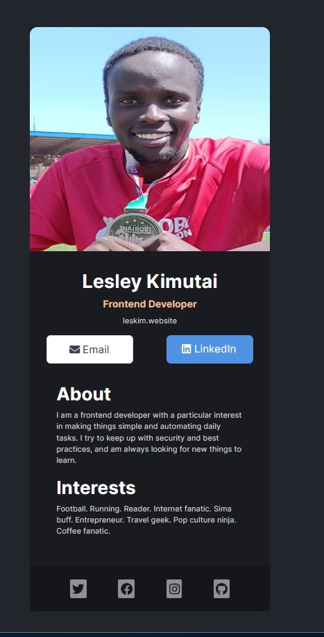

# Scrimba React Solo Project {Business Card}

This project was bootstrapped with [Create React App](https://github.com/facebook/create-react-app).

This is a solution to the [Scrimba React Course on Scrimba](https://scrimba.com/learn/learnreact/react-section-1-solo-project).
The course is offered for FREE on Scrimba by Bob Ziroll [Learn React](https://scrimba.com/learn/learnreact)(An amazing tutor -- really understood his course)

## Table of contents

- [Overview](#overview)
  - [The challenge](#the-challenge)
  - [Screenshot](#screenshot)
  - [Links](#links)
- [My process](#my-process)
  - [Built with](#built-with)
  - [What I learned](#what-i-learned)
  - [Continued development](#continued-development)
- [Author](#author)

## Overview

### The challenge

Create a business card using React

Requirements : -

- Build from Scratch!
- Fill in your own information
- Separate components for :- - Info (photo, name, buttons, etc) - About - Interests - Footer (social icons)
- Enjoy the build

### Screenshot

Screenshot of Business Card .... Looks pretty neat to my eyes😃.

### Links

- Solution URL: (https://github.com/issagoodlifeInc/clipboard-page.git)
- Live Site URL: (https://issagoodlifeinc.github.io/clipboard-page/)

## My process

Not that complicated did the Info first then the About and Interests
which are pretty similar and finally the footer
A whole headache to use [Fontawesome Icons](https://fontawesome.com/docs/web/use-with/react/) for the first time with React works well though 💪🏽

### Built with

- React
- JSX syntax
- Semantic HTML5 markup
- CSS custom properties
- Flexbox

### What I learned

- Intergrating FontAwesome with React

- Creating a React-App using npm

- Using Figma files to code

- React! React! React!

### Continued development

- Learning more React! (yeah reenacting React problems and tackling them)

- Better turnaround time -- simple stuff but worked on it for a while

- Less Code (code cleanup)

## Author

- Website - [Lesley Kimutai](https://leskim.github.io/myweb/)
- Frontend Mentor - (https://www.frontendmentor.io/profile/Leskim)
